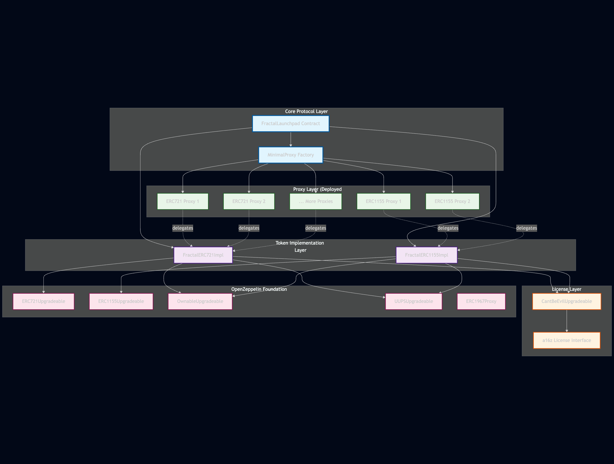

# FractalLaunchpad

A decentralized NFT launchpad platform enabling creators to deploy ERC721 and ERC1155 token collections with integrated a16z CantBeEvil licensing, upgradeability, and comprehensive security features.

## Overview

FractalLaunchpad provides a robust, scalable platform for launching NFT collections with:

- **Multi-Token Support**: Deploy both ERC721 (unique) and ERC1155 (multi-supply) tokens
- **Built-in Licensing**: Integrated a16z CantBeEvil license system with 6 configurable license types
- **Upgrade Ready**: UUPS proxy pattern for seamless contract upgrades with state preservation
- **Gas Optimized**: Minimal proxy pattern for cost-effective token deployment
- **Security First**: Comprehensive access control, input validation, and upgradeability safeguards

## Architecture

The architecture diagram illustrates the complete system design:


```
System Components:
├── Core Protocol Layer (FractalLaunchpad, MinimalProxy Factory)
├── Token Implementation Layer (ERC721, ERC1155)
├── Proxy Layer (Deployed Instances)
├── License Layer (CantBeEvil Integration)
└── OpenZeppelin Foundation (ERC1967Proxy, UUPS, etc.)
```

## Technology Stack

- **Smart Contracts**: Solidity 0.8.20+
- **Testing Framework**: Foundry
- **OpenZeppelin**: Upgradeable contracts library
- **a16z**: CantBeEvil licensing integration
- **Proxy Pattern**: UUPS (Universal Upgradeable Proxy Standard)

## Foundry

**Foundry is a blazing fast, portable and modular toolkit for Ethereum application development written in Rust.**

Foundry consists of:

-   **Forge**: Ethereum testing framework (like Truffle, Hardhat and DappTools).
-   **Cast**: Swiss army knife for interacting with EVM smart contracts, sending transactions and getting chain data.
-   **Anvil**: Local Ethereum node, akin to Ganache, Hardhat Network.
-   **Chisel**: Fast, utilitarian, and verbose solidity REPL.

## Documentation

- **Foundry**: https://book.getfoundry.sh/
- **Architecture**: See [ARCHITECTURE.md](README.md)
- **A16z**: See [A16z.md](./lib/a16z-contracts/README.md)

## Usage

### Build

```shell
$ forge build
```

### Test

Run all tests:
```shell
$ forge test
```

Run specific test suite:
```shell
$ forge test --match-path "test/FractalERC721.t.sol"
$ forge test --match-path "test/FractalERC1155.t.sol"
$ forge test --match-path "test/FractalERC721Upgradeable.t.sol"
$ forge test --match-path "test/FractalERC1155Upgradeable.t.sol"
```

### Format

```shell
$ forge fmt
```

### Gas Snapshots

```shell
$ forge snapshot
```

### Anvil

Start a local Ethereum node:
```shell
$ anvil
```

### Deploy

Deploy contracts to a network:
```shell
$ forge script script/FractalLauncpad.s.sol --rpc-url <your_rpc_url> --private-key <your_private_key> --broadcast
```

### Cast

Interact with deployed contracts:
```shell
$ cast <subcommand>
```

### Help

```shell
$ forge --help
$ anvil --help
$ cast --help
```

## Project Structure

```
FractalLaunchpad/
├── src/
│   ├── FractalLaunchpad.sol         # Main launchpad contract
│   ├── Factory.sol                  # MinimalProxy factory
│   ├── FractalERC721.sol           # ERC721 implementation
│   ├── FractalERC1155.sol          # ERC1155 implementation
│   └── a16z/
│       └── CantBeEvilUpgradeable.sol # License integration
├── test/
│   ├── FractalERC721.t.sol              # ERC721 core tests (57 tests)
│   ├── FractalERC1155.t.sol             # ERC1155 core tests (77 tests)
│   ├── FractalERC721Upgradeable.t.sol   # ERC721 upgrade tests (24 tests)
│   ├── FractalERC1155Upgradeable.t.sol  # ERC1155 upgrade tests (23 tests)
│   └── FractalLaunchad.t.sol            # Launchpad tests (34 tests)
├── script/
│   └── FractalLauncpad.s.sol        # Deployment script
├── lib/                             # Dependencies
│   ├── openzeppelin-contracts/
│   ├── openzeppelin-contracts-upgradeable/
│   ├── a16z-contracts/
│   └── forge-std/
├── foundry.toml                     # Foundry configuration
└── remappings.txt                   # Import remappings
```

## Features

### ERC721 Implementation
- Mint and burn tokens with ownership control
- Batch minting for gas efficiency
- Customizable token URIs
- Maximum supply enforcement
- ERC2981 royalty standard support
- CantBeEvil license integration

### ERC1155 Implementation
- Multi-token support with individual supply limits
- Mint, burn, and batch operations
- Per-token URI management
- Maximum supply per token
- ERC2981 royalty standard support
- CantBeEvil license integration

### Launchpad Protocol
- Streamlined token creation with optional platform fees
- Support for both ERC721 and ERC1155 tokens
- Minimal proxy deployment for gas efficiency
- Launch configuration storage
- Event-based tracking

### License System
- 6 configurable CantBeEvil license types:
  - PUBLIC
  - EXCLUSIVE
  - COMMERCIAL
  - COMMERCIAL_NO_HATE
  - PERSONAL
  - PERSONAL_NO_HATE
- Arweave-hosted license files
- On-chain license verification

## Testing

The project includes comprehensive test coverage:

### Test Breakdown by Suite:
- **57 ERC721 Core Tests**: Standard operations, minting, burning, royalties, and licensing
- **77 ERC1155 Core Tests**: Multi-token operations, batch minting, royalties, and licensing
- **24 ERC721 Upgradeability Tests**: Upgrade scenarios, storage preservation, and state management
- **23 ERC1155 Upgradeability Tests**: Multi-token upgrade testing and state consistency
- **34 Launchpad Tests**: Platform deployment, fee management, and creator workflows


Run all tests with:
```shell
$ forge test
```

View test summary:
```shell
$ forge test --summary
```

## Security Considerations

- **Access Control**: Owner-based authorization for sensitive operations
- **Upgrade Authorization**: Only owner can authorize implementation upgrades
- **State Preservation**: UUPS pattern ensures no storage collisions during upgrades
- **Input Validation**: Comprehensive checks for max supply, token existence, and permissions
- **Royalty Standard**: ERC2981 compliance for marketplace royalty enforcement
- **ERC165 Support**: Standard interface detection for license and royalty compatibility

## Aknowledged Issue (Audit):
- Overpayments during Launch are not refunded. Our UI is designed to prevent this by guiding users to pay the accurate fee.
-  For ERC1155, maxSupply is only set for token ID 0 during initialization, for other IDs, it can be set later using the setMaxSupply function

## License

This project includes licenses from multiple sources:
- **FractalLaunchpad**: See LICENSE file
- **OpenZeppelin**: MIT License
- **a16z**: See license in lib/a16z-contracts/
